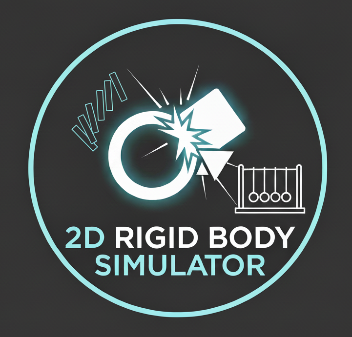
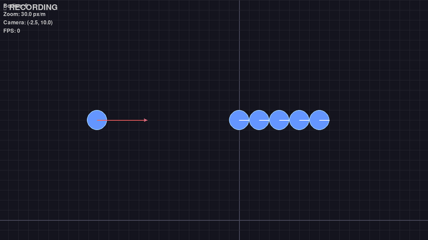
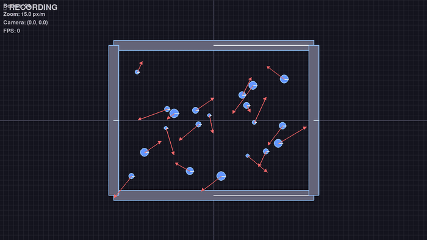
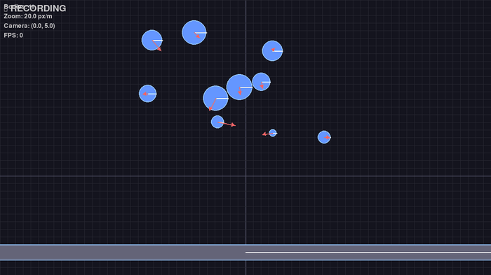

<p align="center">
  
</p>

# 2D Rigid Body Physics Simulator

<p align="center">
  <a href="https://sahand1807.github.io/RigidBodyPhysics-Simulator/">
    
  </a>
  <a href="https://sahand1807.github.io/RigidBodyPhysics-Simulator/cpp/">
    
  </a>
  <a href="https://sahand1807.github.io/RigidBodyPhysics-Simulator/python/">
    
  </a>
</p>

A high-performance 2D rigid body physics engine written in C++ from scratch, with Python bindings for visualization and interaction.

## Gallery

<table>
  <tr>
    <td align="center">
      <br/>
      <b>Momentum Transfer</b><br/>
      Elastic collision chain reaction
    </td>
    <td align="center">
      <br/>
      <b>Balls Chamber</b><br/>
      High-energy particle simulation
    </td>
  </tr>
  <tr>
    <td align="center">
      <br/>
      <b>Ball Pit</b><br/>
      Continuous spawning simulation
    </td>
    <td align="center">
      <br/>
      <b>Bouncing Balls</b><br/>
      Basic physics demonstration
    </td>
  </tr>
</table>

> **Note**: More demos available! Run examples with `python3 python/examples/<demo_name>.py`

## Overview

This project implements a complete 2D physics simulation system from scratch, featuring:

- **Rigid body dynamics**: Circles and boxes with mass, velocity, and angular motion
- **Collision detection**: Efficient algorithms for circle-circle and circle-box collisions
- **Collision resolution**: Impulse-based physics with friction and restitution
- **Python integration**: Easy-to-use Python API for creating scenes and visualizations
- **Interactive demos**: Real-time visualization with Pygame

## Features

### Core Physics Engine (C++)

- **Rigid Bodies**
  - Circle and box objects
  - Mass, position, velocity, angular velocity
  - Semi-implicit Euler integration for stability

- **Collision System**
  - Circle-circle collision detection
  - Circle-box collision detection
  - SAT (Separating Axis Theorem) for box collisions
  - Impulse-based collision resolution
  - Configurable friction and restitution coefficients

- **Constraint System**
  - Distance constraints (XPBD-based)
  - Body-to-world and body-to-body constraints
  - Rigid rods and flexible strings
  - Compliance parameter for stiffness control
  - Energy-conserving velocity updates

- **Forces**
  - Gravity simulation
  - User-applied impulses
  - Force accumulation system

### Python Visualization Layer

- Real-time rendering with Pygame
- Interactive scene creation
- Multiple demo scenarios included

## Project Structure

```
physics_engine/
├── cpp/                    # C++ physics engine
│   ├── include/           # Header files
│   │   ├── math/         # Vector2, Transform
│   │   ├── physics/      # RigidBody, Collider, PhysicsWorld
│   │   └── bindings/     # Python binding headers
│   ├── src/              # Implementation files
│   └── CMakeLists.txt    # Build configuration
├── python/               # Python wrapper and visualization
│   ├── physics_viz/     # Rendering and scene management
│   └── examples/        # Demo scenarios
├── tests/               # Unit tests
└── README.md           
```

## Building from Source

### Prerequisites

- CMake >= 3.12
- C++17 compatible compiler (GCC 7+, Clang 5+, MSVC 2017+)
- Python >= 3.8
- pybind11

### Installation

1. Clone the repository:
```bash
git clone <repository-url>
cd RigidBodyPhysics-Simulator
```

2. Install Python dependencies:
```bash
pip install -r requirements.txt
```

3. Build and install the package:
```bash
pip install -e .
```

## Usage

### Basic Example

```python
from physics_viz import PhysicsWorld, RigidBody

# Create a physics world
world = PhysicsWorld()

# Add a circle
circle = RigidBody(shape='circle', radius=1.0, mass=1.0)
circle.position = (5.0, 10.0)
world.add_body(circle)

# Simulate
for i in range(100):
    world.step(dt=0.016)  # 60 FPS
    print(f"Position: {circle.position}")
```

### Running Demos

```bash
# Interactive Physics Builder (full scene editor)
python3 python/examples/physics_builder.py

# Interactive sandbox (click to spawn balls)
python3 python/examples/sandbox.py

# Bouncing balls demonstration
python3 python/examples/bouncing_balls.py

# High-energy balls in a closed chamber
python3 python/examples/balls_chamber.py

# Momentum transfer through collision chain
python3 python/examples/momentum_transfer.py

# Ball pit with dynamic spawning
python3 python/examples/ball_pit.py

# Newton's cradle with distance constraints
python3 python/examples/newtons_cradle.py
```

**Controls:**
- **Mouse Drag**: Pan camera
- **Mouse Wheel**: Zoom in/out
- **Space**: Pause/Resume simulation
- **R**: Reset simulation
- **G**: Toggle grid display
- **V**: Toggle velocity vectors
- **H**: Toggle help overlay
- **ESC**: Quit

## Demo Scenarios

1. **Physics Builder**: Full-featured scene editor with UI controls
   - Select shape type (circle/box) and configure parameters
   - Set position, size, mass, and velocity
   - Toggle objects between static and dynamic
   - Enable/disable gravity
   - Material properties hardcoded (restitution=0.9, no friction)
   - Reset to initial state, zoom in/out
   - Build complete scenes then run simulations
2. **Interactive Sandbox**: Click to spawn random balls and watch them interact
3. **Bouncing Balls**: Simple demonstration of balls bouncing with varying properties
4. **Balls Chamber**: High-energy particles bouncing in a closed chamber
5. **Momentum Transfer**: Projectile hits stationary chain, demonstrating elastic collision momentum transfer
6. **Ball Pit**: Continuous spawning of balls into a container
7. **Newton's Cradle**: Interactive demonstration of conservation of momentum and energy
   - Adjustable number of balls (3-15)
   - Configurable rod length (2-10m)
   - Initial angle control (0-60°)
   - Real-time energy display (kinetic, potential, total)
   - Play/pause/reset controls
   - Showcases XPBD distance constraints with energy conservation

## Physics Theory

### Rigid Body Dynamics

A rigid body is an idealized solid object that doesn't deform. Each body can be fully defined using its:
- **Position** (x, y): Center of mass location
- **Velocity** (vx, vy): Linear motion
- **Angle** θ: Orientation
- **Angular velocity** ω: Rotational motion
- **Mass** m: Resistance to linear acceleration
- **Moment of inertia** I: Resistance to angular acceleration

### Integration

In this prject we use **semi-implicit Euler integration**:
```
v(t+dt) = v(t) + a(t) * dt
x(t+dt) = x(t) + v(t+dt) * dt
```

This provides better energy conservation than explicit Euler. Explicit Euler tends to add energy over time which leads to the simulated object speeding up or oscillating.

### Collision Response

Collisions are resolved using **impulse-based resolution**:
1. Detect collision and compute contact normal
2. Calculate relative velocity at contact point
3. Compute impulse magnitude: `j = -(1 + e) * v_rel · n / (1/m1 + 1/m2)`
4. Apply equal and opposite impulses to bodies

Where:
- `e` is the coefficient of restitution (bounciness)
- `n` is the collision normal
- `v_rel` is the relative velocity

## Development Roadmap

- [x] Phase 1: Project setup
- [x] Phase 2: Core math (Vector2, Transform)
- [x] Phase 3: Basic physics (RigidBody, CircleCollider, PhysicsWorld)
- [x] Phase 4: Collision system (circle-circle detection and response)
- [x] Phase 5: Python bindings (pybind11, full C++ API exposure)
- [x] Phase 6: Visualization (Pygame, camera system, interactive demos)
- [x] Phase 7: Enhanced features (BoxCollider, box-circle collision, realistic ground planes)
- [x] Phase 8: Constraint system (XPBD distance constraints, Newton's cradle demo)


## Documentation

### Manual Documentation

Comprehensive guides are available in the `docs/` directory:
- `01_Vector2_Documentation.md` - Vector math operations
- `02_Transform_Documentation.md` - Position and rotation transforms
- `03_RigidBody_Documentation.md` - Rigid body physics
- `04_Collider_CircleCollider_Documentation.md` - Circle colliders
- `05_PhysicsWorld_Documentation.md` - Physics simulation world
- `06_Collision_System_Documentation.md` - Collision detection and resolution
- `07_Python_Bindings_Documentation.md` - Python API bindings
- `08_BoxCollider_Documentation.md` - Box colliders and SAT
- `09_Interactive_Physics_Builder.md` - Scene editor documentation
- `10_Constraint_System_Documentation.md` - Physics constraints (XPBD)
- `11_Newtons_Cradle_Example.md` - Newton's cradle demo guide

### API Documentation

**Online Documentation (Automatically Updated):**

API documentation is automatically built and hosted via GitHub Actions + GitHub Pages:
- **[View Online Documentation](https://sahand1807.github.io/RigidBodyPhysics-Simulator/)**
- C++ API (Doxygen) - Class hierarchies, call graphs, complete reference
- Python API (Sphinx) - Python bindings and visualization modules

**Build Locally:**

Generate comprehensive API documentation locally using:

**C++ API (Doxygen)**:
```bash
doxygen Doxyfile
# Output: docs/api/cpp/html/index.html
```

**Python API (Sphinx)**:
```bash
cd python
sphinx-apidoc -f -o docs/api/source physics_viz
cd docs/api && make html
# Output: python/docs/api/build/html/index.html
```

See `docs/README_API_DOCS.md` for local build instructions and `docs/README_HOSTING.md` for GitHub Pages setup.

## Creator

Sahand Sadeghi - [Intelligent Dynamics](http://inteldynamic.com/)